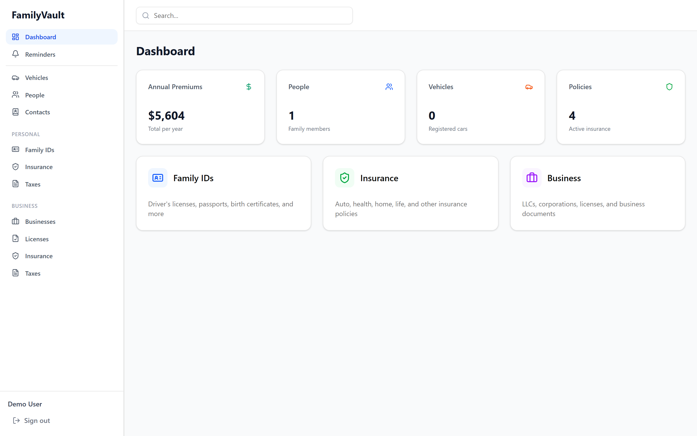
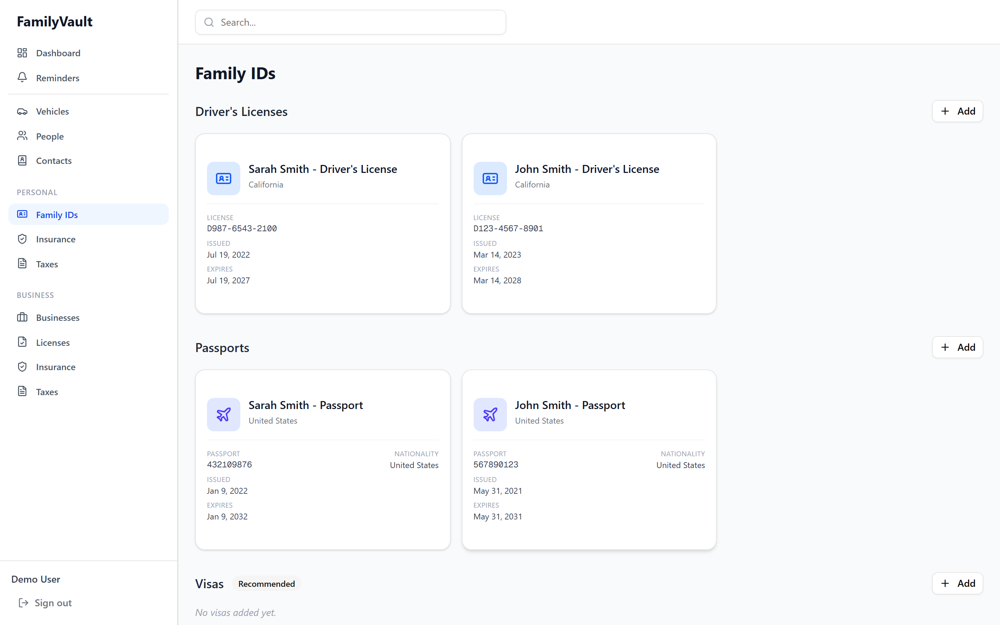
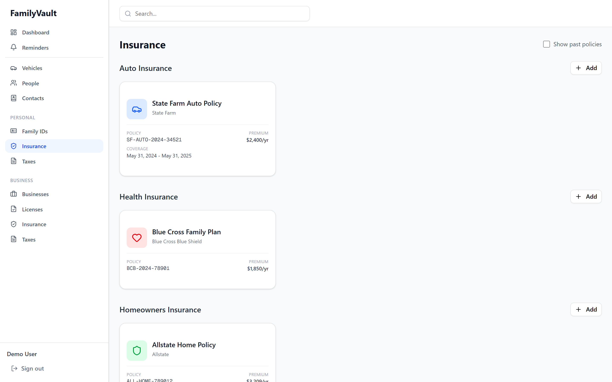
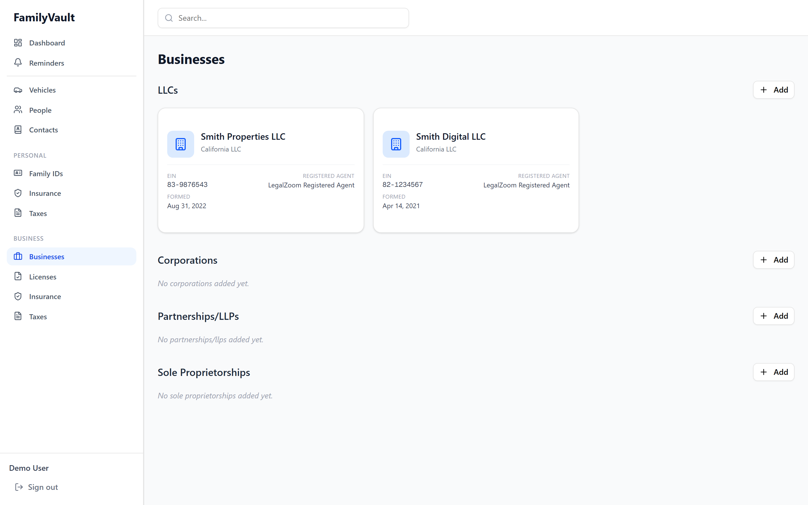
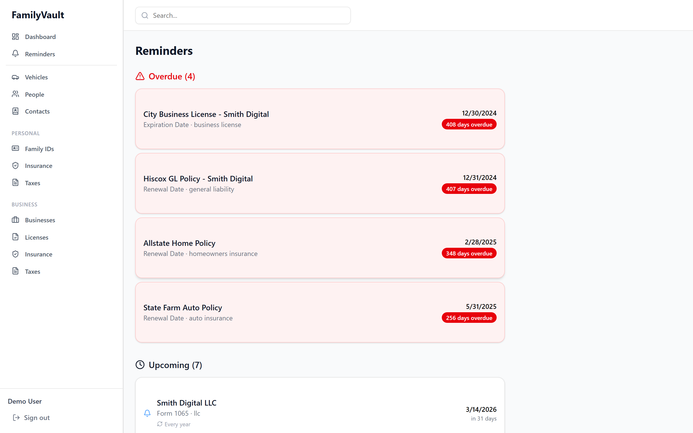
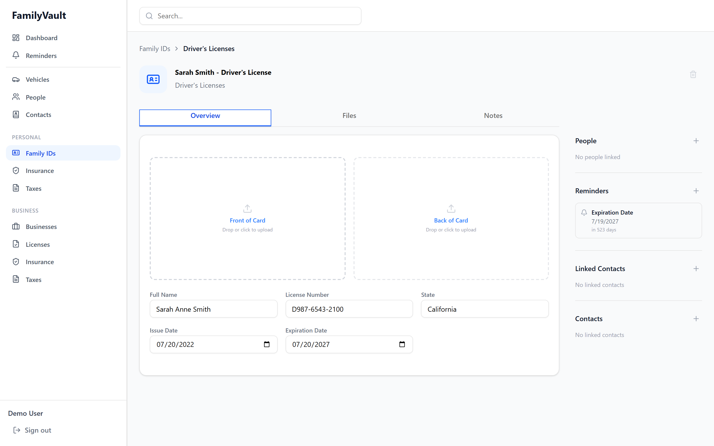

# Family Vault

> A self-hostable "Family Operating System" for securely managing IDs, insurance, business documents, and important family information.

[](https://hub.docker.com/r/elgon2003/family-vault)
[](LICENSE)

<p align="center">
  
</p>

## Overview

Family Vault is a secure, self-hosted digital vault that helps families organize and manage their important documents and information in one centralized place. Think of it as your family's personal operating system for managing IDs, insurance policies, business documents, and more.

### Key Features

- **📇 Digital ID Management** - Driver's licenses, passports, visas, social security cards, birth certificates
- **🏥 Insurance Tracking** - Health, auto, home, and life insurance with coverage details and reminders
- **💼 Business Documents** - LLCs, corporations, licenses, tax documents
- **🔔 Smart Reminders** - Automatic expiration tracking and custom reminder system with email notifications
- **🔐 Military-Grade Encryption** - AES-256-GCM envelope encryption for all uploaded files
- **👥 Multi-User Organizations** - Share access with family members with role-based permissions
- **🌍 Visa Management** - Track visas with automatic country-specific help contact information
- **📎 File Attachments** - Securely store card images and documents with built-in image editing
- **🔍 Powerful Search** - Find anything across all your items instantly

## Quick Start

### Prerequisites

- [Docker](https://www.docker.com/get-started) and Docker Compose
- 2GB RAM minimum (4GB recommended)
- 10GB disk space for data storage

### Option A: Docker Hub (Fastest)

Pre-built images are available on [Docker Hub](https://hub.docker.com/r/elgon2003/family-vault):

```bash
# Download the compose file
curl -LO https://raw.githubusercontent.com/DEADSEC-SECURITY/family-vault/master/docker-compose.yml
curl -LO https://raw.githubusercontent.com/DEADSEC-SECURITY/family-vault/master/.env.example
cp .env.example .env
# Edit .env and set SECRET_KEY (run: openssl rand -hex 32)
docker-compose up -d
```

### Option B: Build from Source

1. **Clone the repository**
   ```bash
   git clone https://github.com/DEADSEC-SECURITY/family-vault.git
   cd family-vault
   ```

2. **Configure environment variables**
   ```bash
   cp .env.example .env
   # Edit .env and change SECRET_KEY and any other settings
   ```

3. **Start the application**
   ```bash
   docker-compose up -d
   ```

4. **Access Family Vault**
   - Open your browser to `http://localhost:3000`
   - Register a new account (first user becomes the organization owner)

That's it! Your Family Vault is now running locally.

## Architecture

Family Vault consists of four main services:

- **Frontend** - Next.js 16 with React, TypeScript, and Tailwind CSS
- **Backend** - Python FastAPI with SQLAlchemy 2.0
- **Database** - PostgreSQL 17
- **File Storage** - MinIO (S3-compatible object storage)

All services run in Docker containers and can be easily deployed together or scaled independently.

## Tech Stack

| Component | Technology |
|-----------|-----------|
| Frontend Framework | Next.js 16 (App Router) |
| UI Components | shadcn/ui + Tailwind CSS |
| Backend API | Python FastAPI |
| Database | PostgreSQL 17 |
| ORM | SQLAlchemy 2.0 |
| Migrations | Alembic |
| File Storage | MinIO (S3-compatible) |
| Authentication | Session-based (bcrypt) |
| Encryption | AES-256-GCM envelope encryption |
| Email | SMTP (optional, for reminders) |

## Configuration

### Environment Variables

Copy `.env.example` to `.env` and customize:

```bash
# Database
POSTGRES_DB=familyvault
POSTGRES_USER=familyvault
POSTGRES_PASSWORD=change_me_in_production

# MinIO (S3)
S3_ACCESS_KEY=minioadmin
S3_SECRET_KEY=change_me_in_production
S3_BUCKET=familyvault

# Backend
SECRET_KEY=change_me_to_a_long_random_string
CORS_ORIGINS=["http://localhost:3000"]

# Optional: Email for reminder notifications
SMTP_HOST=smtp.gmail.com
SMTP_PORT=587
SMTP_USER=your_email@gmail.com
SMTP_PASSWORD=your_app_password
SMTP_FROM=noreply@familyvault.local
```

### Using External Services

Family Vault can use external PostgreSQL and S3-compatible storage:

```bash
# Use external PostgreSQL
POSTGRES_HOST=mydb.example.com
POSTGRES_PORT=5432

# Use AWS S3 instead of MinIO
S3_ENDPOINT_URL=https://s3.amazonaws.com
S3_ACCESS_KEY=your_aws_access_key
S3_SECRET_KEY=your_aws_secret_key
S3_REGION=us-east-1
```

Then remove the `postgres` and `minio` services from `docker-compose.yml`.

## Security

### File Encryption

All uploaded files are encrypted at rest using AES-256-GCM:

1. **Server Master Key** - Derived from `SECRET_KEY` environment variable
2. **Organization Keys** - Each organization gets a unique encryption key
3. **File-Specific Keys** - Each file is encrypted with a unique data encryption key (DEK)
4. **Zero-Knowledge Storage** - Even if someone accesses your MinIO bucket directly, files are unreadable encrypted blobs

### Authentication

- Password hashing with bcrypt (12 rounds)
- Session-based authentication with opaque tokens
- Session tokens expire after 30 days of inactivity
- All API endpoints require authentication

### Best Practices

1. **Change the SECRET_KEY** - Use a long random string (minimum 32 characters)
2. **Use strong passwords** - Enforce strong passwords for all users
3. **Enable HTTPS** - Use a reverse proxy (nginx, Caddy) with SSL certificates
4. **Regular backups** - Back up PostgreSQL database and MinIO data regularly
5. **Keep updated** - Pull the latest Docker images regularly for security patches

## Features in Detail

### Family IDs

Manage all your family's identification documents:
- Driver's Licenses
- Passports
- Visas (with passport linking and automatic country contact info)
- Social Security Cards
- Birth Certificates
- Custom ID Types

Each ID card displays with a specialized layout and automatic security number masking.

<p align="center">
  
</p>

### Insurance

Track all insurance policies with comprehensive coverage details:
- **Health Insurance** - Plan limits, copays, coinsurance, in-network providers
- **Auto Insurance** - Link vehicles, track coverage types and limits
- **Home Insurance** - Property coverage and liability details
- **Life Insurance** - Beneficiaries and policy details

<p align="center">
  
</p>

### Business Documents

Manage your business entities, licenses, and commercial insurance:
- LLCs, Corporations, Partnerships, Sole Proprietorships
- Business licenses and permits with expiration tracking
- General liability, professional liability, workers' comp, and more

<p align="center">
  
</p>

### Reminders

Never miss an expiration date:
- **Auto-detected Reminders** - Automatically tracks expiration dates from your items
- **Custom Reminders** - Set manual reminders for any item
- **Email Notifications** - Optional hourly check sends emails when reminders are due
- **Repeating Reminders** - Set reminders to repeat annually

<p align="center">
  
</p>

### Item Detail & File Management

Each item has a full detail view with editable fields, file upload slots, linked contacts, people, and reminders.

- **Drag & Drop Upload** - Easy file attachment
- **Image Editor** - Built-in crop and rotate for card images
- **Auto-orientation** - Portrait images automatically rotate to landscape
- **Multiple File Slots** - Front/back of cards, policy documents, etc.
- **Secure Download** - Files are decrypted on-the-fly when you download

<p align="center">
  
</p>

## Development

### Prerequisites

- Node.js 22+
- Python 3.13+
- Docker and Docker Compose

### Local Development Setup

1. **Backend**
   ```bash
   cd backend
   python -m venv venv
   source venv/bin/activate  # On Windows: venv\Scripts\activate
   pip install -r requirements.txt

   # Run migrations
   alembic upgrade head

   # Start dev server
   uvicorn app.main:app --reload
   ```

2. **Frontend**
   ```bash
   cd frontend
   npm install
   npm run dev
   ```

3. **Database & MinIO**
   ```bash
   docker-compose up postgres minio
   ```

### Running Tests

```bash
# Backend tests
cd backend
pytest

# Frontend tests
cd frontend
npm test
```

## Deployment

### Docker Compose (Recommended)

See Quick Start section above. For production:

1. Use a reverse proxy (nginx/Caddy) with SSL
2. Change all default passwords and keys
3. Set up regular backups
4. Enable SMTP for email notifications

### Manual Deployment

See [DEPLOYMENT.md](docs/DEPLOYMENT.md) for detailed deployment instructions for various platforms (AWS, Google Cloud, DigitalOcean, etc.).

## Contributing

We welcome contributions! Please see [CONTRIBUTING.md](CONTRIBUTING.md) for details.

### Development Workflow

1. Fork the repository
2. Create a feature branch (`git checkout -b feature/amazing-feature`)
3. Make your changes
4. Write or update tests
5. Commit your changes (`git commit -m 'Add amazing feature'`)
6. Push to the branch (`git push origin feature/amazing-feature`)
7. Open a Pull Request

## Roadmap

- [ ] Mobile apps (iOS/Android)
- [ ] Document OCR for automatic field extraction
- [ ] Shared item permissions (granular access control)
- [ ] Audit log for all changes
- [ ] Export/import functionality
- [ ] Two-factor authentication
- [ ] API key authentication for automation
- [ ] Webhook integrations

## License

This project is licensed under the **Business Source License 1.1** (BSL 1.1).

- **Personal / non-commercial use**: Free, no restrictions
- **Commercial use**: Requires a commercial license — [contact us](https://github.com/DEADSEC-SECURITY/family-vault/issues)
- **Change Date**: February 12, 2030 — on this date, the code automatically converts to **GPL v2.0** (fully open-source)

See the [LICENSE](LICENSE) file for full details.

## Support

- **Documentation**: [docs/](docs/)
- **Issues**: [GitHub Issues](https://github.com/DEADSEC-SECURITY/family-vault/issues)
- **Discussions**: [GitHub Discussions](https://github.com/DEADSEC-SECURITY/family-vault/discussions)

## Acknowledgments

- Built with [Next.js](https://nextjs.org/), [FastAPI](https://fastapi.tiangolo.com/), and [shadcn/ui](https://ui.shadcn.com/)
- Inspired by [Trustworthy](https://www.trustworthy.com/)
- Icons by [Lucide](https://lucide.dev/)

---

**Made with ❤️ for families who value security and organization**
